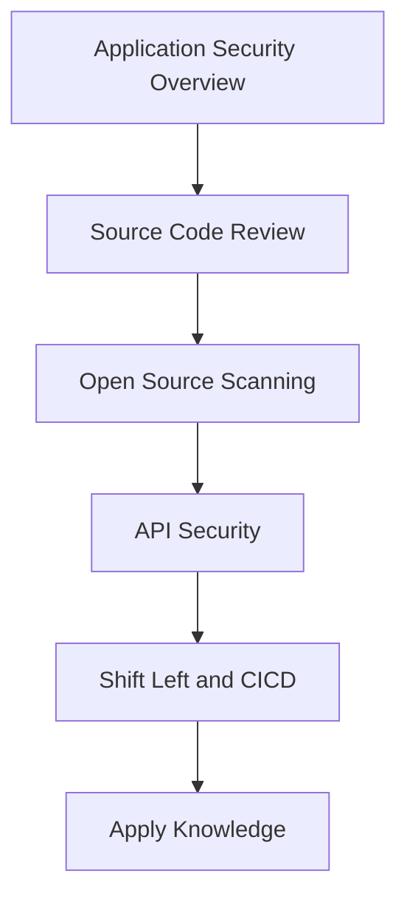

# Application Security Training Curriculum

This curriculum provides a structured path through talks and resources related to **Application Security**.

## Suggested Learning Path

## How to Use This Curriculum

1. Watch the talks in the suggested order when present. If no order is present, skim titles and start with fundamentals.
2. Take notes. Capture core concepts, critical vocabulary, tools, and practical takeaways.
3. Practice. Recreate demos in a lab. Build a small asset to apply the idea.
4. Review. Summarize key points and write one paragraph on how to apply them at work.
5. Connect. Compare notes with peers, then refine your personal checklist.

## Available Talks

### SecKC Submission
- Speaker: Luke Crouch:
- Recorded: 2016
- Key Takeaways:
  - There are over 5,000 online trackers that use cookies, fingerprinting, and probabilistic device matching to follow you across the web. Some methods are actively used for fraud, malware, and intrusive user tracking. Some are commonly used for legit purposes. We'll talk about how sites are able to follow users, tracking methods both fair and foul, and how Mozilla protects users from tracking.

### SecKC Submission
- Speaker: Gared Seats
- Recorded: 2016
- Watch: https:///www.youtube.com/watch?v=ytUJI38V4jc
- Key Takeaways:
  - Ever wonder what "git" actually is? 1. You think git is something someone says instead of "GO AWAY" 2. You believe it is a completely ignorant, childish person with no manners. 3. Something some would say when they mean "get it" but decide to only say one word instead of two. 4. You think it is a version control system that is used for software development and other version control tasks. As a distributed revision control system it is aimed at speed, data integrity, and support for distributed, non-linear workflows. 5. You're just at SecKC for the cool talks and meeting super cool people and saw there was a tool talk on git. If any of that applies to you then this is the talk is for you. We will briefly go over git and how it can be beneficial to you.

### SecKC Submission
- Speaker: Shogo Cottrell
- Recorded: 2017
- Key Takeaways:
  - Using a Raspberry Pi, you can build your own Amazon Echo with Alexa voice recognition. Play music, control your lights, get answers to trivia, find out the weather, and more.

### SecKC Submission
- Speaker: Cory Kennedy
- Recorded: 2017
- Key Takeaways:
  - [work in progress, I may update this] - Many of us use python to solve our programming[strikeout], scripting needs. In this talk I am going to show you how to solve the same problems with a new language that may just make your life easier. Why should you learn GoLang? Malware authors have begun to use Go so why haven't you?

### SecKC Submission
- Speaker: August Johnson
- Recorded: 2017
- Watch: https:///www.youtube.com/watch?v=zNPnw_DalCQ
- Key Takeaways:
  - Software is cruddy. These tools help to make it better. This will be a review of various software security assurance tools, and a more in-depth look at the OWASP SAMM, what you can adopt, and how it can benefit coders, and really, anyone who uses the software.

### SecKC Submission
- Speaker: Andy Nelson
- Recorded: 2018
- Watch: https:///www.youtube.com/watch?v=zKKsiD_R0mI
- Key Takeaways:
  - With the release of the OWASP (Open Web Application Security Project) Top 10 for 2017, injection is again at the top of the list. As software engineers, most of us are aware that injection attacks exist. However, we are rarely aware of how easy they are to perform or what it takes to defend them. In this talk, I will create a simple test application that has some injection vulnerabilities that you might find in applications you work on today. Then I will show you how easy they are to exploit both manually and with “h4ck3r t00lz”. Lastly, I will show you how to change your code to defend against these attacks. If you are a software engineer that wants to have a better understanding of how easy it is to defend your application, then this talk is for you.

### SecKC Submission
- Speaker: Josh Rickard
- Recorded: 2019
- Watch: https:///www.youtube.com/watch?v=NGdLb278adw
- Key Takeaways:
  - Are you familiar with PowerShell? Is your go to language Python? Do you want to start (or continue) automating everyday tasks? Whether your a PowerShell wizard or a Python novice, this talk will help you understand the basics of these two powerful languages. During this talk I will give a side-by-side comparison of a PowerShell Core Module & Python package. This fast paced talk starts with how to install and use each language and will cover the basics of variables, how to install and use third-party libraries, interacting with APIs, creating scripts, functions/methods, and ends with an introduction to Classes.

### SecKC Submission
- Speaker: Greg Lauer
- Recorded: 2020
- Key Takeaways:
  - Learn about Software Security Assurance programs and how security champions expand the security resources.

### SecKC Submission
- Speaker: Matty McFatty
- Watch: https:///www.youtube.com/watch?v=qR-gy3FAPqk

## Milestones and Self check

- I can add SAST and dependency scan to a repo and gate on severity.
- I can review one PR for authz pitfalls and propose fixes.
- I can run a simple threat model on an API route and log assumptions.

## Supplemental Learning and Adjacent Topics

- Add SAST and dependency scan to a demo repo
- Write a simple secure coding checklist for dev PRs
- Threat model a JSON API and list authz pitfalls

