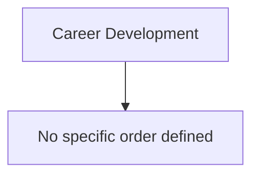

# Career Development Training Curriculum

This curriculum provides a structured path through talks and resources related to **Career Development**.

## Suggested Learning Path

## How to Use This Curriculum

1. Watch the talks in the suggested order when present. If no order is present, skim titles and start with fundamentals.
2. Take notes. Capture core concepts, critical vocabulary, tools, and practical takeaways.
3. Practice. Recreate demos in a lab. Build a small asset to apply the idea.
4. Review. Summarize key points and write one paragraph on how to apply them at work.
5. Connect. Compare notes with peers, then refine your personal checklist.

## Available Talks

### SecKC Submission
- Speaker: John Winger
- Recorded: 2016
- Key Takeaways:
  - Be a Mentor! How to get involved and the benefits a small investment of your personal time can bring to your community.

### SecKC Submission
- Speaker: Stan Elliott
- Recorded: 2017
- Key Takeaways:
  - The Missouri Innovation Campus (MIC) program will be described and it will be illustrated how it meets talent needs in the KC region as the MIC already has 45 corporate partners. Special emphasis will be made on how the engineers and professionals of our partners develop the curriculum for the four MIC programs and the benefit of the 3 year, year round paid internship program that helps to develop our interns and cut training costs for our partners. Students in the MIC receive their BS degree two years after graduating HS!!!

### SecKC Submission
- Speaker: Bryan C. Geraghty (@archwisp)
- Recorded: 2017
- Key Takeaways:
  - I will start with the 101 basics and then dive deep into team workflows, release management, and devops

### SecKC Submission
- Speaker: Mark Bayley (@dispareo)
- Recorded: 2018
- Key Takeaways:
  - For budding hackers - how to go from 0 IT experience to being a security practitioner

### SecKC Submission
- Speaker: Aaron Crawford
- Recorded: 2018
- Key Takeaways:
  - How can you get started contributing to the community through participation at Sec KC? Sec KC is the most open and largest information security meetup in the world, with several opportunities arise for speaking and sharing research and information. The meetings are the safest in the world as all ideas and their exchange are protected, but how do you get started? What do you have to talk about? What resources do you have at your disposal? Sec KC is an amazing resource and platform for the security community, and this brief talk will cover: 1. How to give a talk at Sec KC 2. How to choose a topic 3. How to compile a talk with slides/visuals 4. What resources are available to speakers? 5. Why you don’t have to worry presenting at Sec KC (why we have your back)? 6. Getting over shyness/presentation jitters/introversion/excuses 7. You gave your talk now what? This talk can be 10 minutes or up to 45/50 minutes. The purpose of this talk is to get everyone out of their seats and into the mode of thinking about their talk for the next meeting. Additionally, if any wallflowers are toying with the idea of a talk I want to encourage them and get them everything they need to present at a meeting.

### SecKC Submission
- Speaker: Aaron Crawford
- Recorded: 2018
- Watch: https:///www.youtube.com/watch?v=Jhak0hezZfg
- Key Takeaways:
  - Few remember the humble beginnings of SecKC from the days of Gert’s grill. Now SecKC has become the largest monthly information security meetups in the world. How did it get this big and how can you help to grow it even bigger? Even better how can you contribute and score big? Learn from a marketing and design professional, how to effectively market through social media SecKC and yourselves. Discover how to build your own brand and help promote SecKC. This brief talk and discussion will cover: 1. Where did it all come from? 2. Where is SecKC now? 3. Where can we all take SecKC? 4. How to use social media channels 5. Marketing your message 6. Choosing distribution channels for your message 7. Get different and don’t be afraid 8. Hidden personal benefits for you 9. What’s next? 10. Summary and resources This talk can be 10 minutes or up to 20 minutes.

### SecKC Submission
- Speaker: me (Dont display my name!!!!!) Instead, please display Dispareo
- Recorded: 2019
- Key Takeaways:
  - This could be a family friendly talk if SecKC ever does one. However, it works as a stand-alone talk as well. During this talk, I will discuss programs for parents of younger learners (namely, Middle school and above) and will discuss programs to help children grow in cybersec and coding such as FIRST LEGO League, Google's Coder Dojo, MS/HS CTF events (there are a few) and online places to hone skills,

### SecKC Submission
- Speaker: Yongzhi Joe Wang
- Recorded: 2019
- Key Takeaways:
  - In this talk, I will discuss required skills and knowledge that transform a novice into a cybersecurity specialist. The talk will also discuss several popular cybersecurity certificates, as well as books. In the end, I will introduce Park University 's bachelor's and certificate program.

### SecKC Submission
- Speaker: Luke Polson
- Recorded: 2019
- Watch: https:///www.youtube.com/watch?v=MWZxdcwTWRQ
- Key Takeaways:
  - We see the headlines talking about the infosec talent gap almost every week. As an industry we are hungry for new recruits. I contend we have a mostly untapped talent pool practically outside our back door. This talk will make the case for why recruits in rural areas are attractive for us as a community and why we should be paying more attention to recruiting our rural neighbors.

### SecKC - March 2020
- Speaker: @archwisp
- Recorded: 2020 03
- Watch: https:///www.youtube.com/watch?v=01v3e0wBGUQ

### SecKC - September 2020
- Recorded: 2020 09
- Key Takeaways:
  - So what is this Discord + YouTube arrangement? Basically it works like this: One person will be the stream director. Stream director connects with the speaker(s) via a direct video chat...they pop the window open and stream that window to the world via OBS

### SecKC - November 2020
- Speaker: Speaker Submission
- Recorded: 2020 11

### SecKC - February 2021
- Speaker: @geoda
- Recorded: 2021 02
- Watch: https:///www.youtube.com/watch?v=JkKerHFYHZo

### SecKC - February 2021
- Speaker: @triw0lf
- Recorded: 2021 02
- Watch: https:///www.youtube.com/watch?v=JkKerHFYHZo

### SecKC Submission
- Speaker: eric - sorry for spam again..
- Recorded: 2021
- Key Takeaways:
  - eric - sorry for spam again..

### SecKC Submission
- Speaker: Patrick Ecord
- Recorded: 2021
- Key Takeaways:
  - It all started out so simple, just a little raspberry pi and an external USB hard drive so I'd have a network share. Next thing I know I am getting deeper into linux and into docker and into self hosting and I am buying old server hardware off ebay, making frankenstein machines and hosting services my friends and family use. I'll tell you about my journey into building a homelab and my successes and failures and what it means to run your own services.

### SecKC Submission
- Speaker: Cosette Mazet
- Recorded: 2021
- Key Takeaways:
  - Explanation fas to how to generate curiosity. What can we do to spark the interest for the next generation? How come there’s a gap of interest? Why do so many people get caught up in social media and why not doing the physical work to change the future? What needs to be done in order to proceed forward. Is it the education and/or culture that some of us grew up with?

### SecKC - June 2022
- Speaker: @geoda
- Recorded: 2022 06

### SecKC - June 2022
- Speaker: @triw0lf
- Recorded: 2022 06

### SecKC - March 2023
- Speaker: @triw0lf
- Recorded: 2023 03

### SecKC Onesie
- Speaker: Speaker Submission
- Recorded: 2023 04

### SecKC Retro Shirt
- Speaker: Speaker Submission
- Recorded: 2023 04

### SecKC Submission
- Speaker: Sandy Uraz
- Recorded: 2023
- Key Takeaways:
  - This is a relatively short story on a quirky startup made by a bored high school student, who after finals thought to himself—why not make the meme investing as seen on r/MemeEconomy... a reality? (and make some $$$ on the side)

### SecKC - July 2024 (Picnic)
- Speaker: Speaker Submission
- Recorded: 2024 07

### SecKC - September 2024
- Speaker: Speaker Submission
- Recorded: 2024 09

### SecKC Submission
- Speaker: Ellwood thewood (no real name, pls, even if it is easy enough to google)
- Recorded: 2025
- Key Takeaways:
  - Career development can be expensive, and is absolutely necessary. Some employers look favorably on institutional training from a well-known vendor, or well-known conferences. This talk will discuss using side gigs to maximize your ability as an IT Professional to fund your learning and travel and get the government to let you do it in a tax advantaged way! In today's dynamic professional landscape, continuous development is not just a luxury but a necessity for success. Employers require you to have experience, and training, and don't always want to pay for you to get that. If you’re looking to start a new career, interviewing with a new employer, or just looking to move to a position within your current company, there are ways you can help fund your own career development and have fun doing it. Networking is just as important in our career field as many others. Traveling to conferences, meeting new folks and reconnecting with old acquaintances could lead to the next development for your future. This talk will cover areas such as • What can an LLC do for you? • Legal activities you might be able to write off for development - Including travel related expenses! • Tips to avoid getting into trouble

### Make Your Own Way, Or Help Someone Do It
- Watch: https:///www.youtube.com/watch?v=0mkWnRIkpPk
- Key Takeaways:
  - There are naysayers and there are "experts", but no one can say you have to follow a certain path. Learn to bypass standard requirements and start paving a path to your dream job, without spending $10k+. If you already love your work then find someone to mentor to get where you are.

### Overcoming obstacles when breaking into an IT career
- Watch: https:///www.youtube.com/watch?v=0mkWnRIkpPk
- Key Takeaways:
  - I will be discussing the obstacles I've personally faced being 30 years old, with a history of purely blue collar jobs ranging from the military infantry, oilfield, and food service. Topics include: Obstacles like needing money in the moment more than the education to do better. How to make time to study. The importance of networking. Staying positive when things start going sideways. How did I survive working a full time job, with two children and a pregnant wife, AND go to school?

## Milestones and Self check

- I can draft a 30 60 90 plan for a role of interest.
- I can quantify two past wins with impact and evidence.
- I can mentor or be mentored and record outcomes.

## Supplemental Learning and Adjacent Topics

- Draft a 30 60 90 plan for a new role
- Collect measurable wins from two past projects
- Mentor someone and document outcomes

