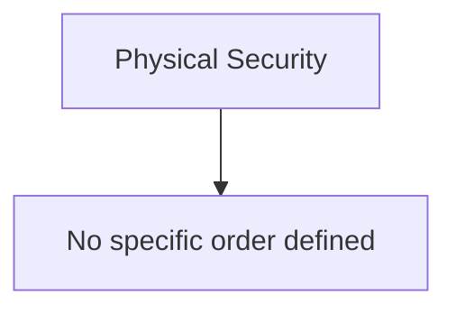

# Physical Security Training Curriculum

This curriculum provides a structured path through talks and resources related to **Physical Security**.

## Suggested Learning Path

## How to Use This Curriculum

1. Watch the talks in the suggested order when present. If no order is present, skim titles and start with fundamentals.
2. Take notes. Capture core concepts, critical vocabulary, tools, and practical takeaways.
3. Practice. Recreate demos in a lab. Build a small asset to apply the idea.
4. Review. Summarize key points and write one paragraph on how to apply them at work.
5. Connect. Compare notes with peers, then refine your personal checklist.

## Available Talks

### SecKC Submission
- Speaker: RSAXVC
- Recorded: 2017
- Watch: https:///www.youtube.com/watch?v=ti0AoZ46wNg
- Key Takeaways:
  - Learn the basics of examining circuit boards, identifying bus voltage, serial format, and baud rate with a oscilloscope hooked up to the SecKC projector. We'll start with care and feeding, then look at some synthetic signals, then move on to identifying a serial port on an embedded Linux computer, figuring out it's pinout and baud rate, then connecting to it.

### SecKC Submission
- Speaker: Arden Meyer
- Recorded: 2018
- Watch: https:///www.youtube.com/watch?v=OVp_NVTQGEM
- Key Takeaways:
  - The mechanical pin and tumbler locks we use on our homes, schools, and businesses have not changed much in over 100 years. Sure, there have been some exotic new designs but most are just not fiscally feasible compared to their relatively minor improvements (if any) in security. A feature desired on large scale deployments is called Master Keying, which allows for many unique key/lock combinations while supporting multiple permission levels commonly referred to as "janitor keys" or "security keys" that can open multiple locks. While these systems are still in use around the globe in medium-to-large scale businesses, schools, and government buildings, they are also susceptible to what some consider to be the original privilege escalation attack. We will talk about an optimization attack against the most common master keyed lock systems in use today, reducing the potential attack surface from 1,000,000 permutations for an SC4 keyway system down to 42 steps to find the highest privilege key.

### SecKC Submission
- Speaker: Ari Ramcharan
- Recorded: 2019
- Key Takeaways:
  - This talk will cover the basics of how locks work and how to bypass locks through picking and raking.

### SecKC Submission
- Speaker: Patrick Ecord
- Recorded: 2023
- Key Takeaways:
  - Have you ever wondered how 3D printing works, and what you can do with it? 3D printing is a technology that allows you to create physical objects from digital models, layer by layer. It has applications in many fields, such as art, engineering, medicine, education, and entertainment. In this talk, you will learn about the history of 3D printing, how it works, what materials and techniques are used, and what are some of the amazing things people have made with it. You will also get a chance to see some 3D printers in action, and discover how you can get started with 3D printing yourself. Whether you are a beginner or an expert, this talk will inspire you to explore the possibilities of 3D printing and turn your ideas into reality.

### SecKC Submission
- Speaker: Ari Ramcharan
- Recorded: 2025
- Watch: https:///www.youtube.com/watch?v=1lpcSaIqvRc
- Key Takeaways:
  - An introductory presentation on the basics of lockpicking. Topics covered will include operating principles of standard pin-tumbler lock operations, how to take advantage of tolerance, and how to manually leverage individual pins to pick a lock.

### SecKC Submission
- Speaker: Gene Turner

## Milestones and Self check

- I can assess a site perimeter and badge process.
- I can write a visitor policy one pager.
- I can align physical alerts with SOC notifications.

## Supplemental Learning and Adjacent Topics

- Walk a site and note perimeter controls
- Review badge issuance and revocation
- Create a visitor policy one pager

