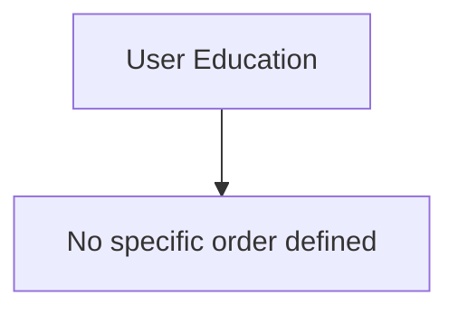

# User Education Training Curriculum

This curriculum provides a structured path through talks and resources related to **User Education**.

## Suggested Learning Path

## How to Use This Curriculum

1. Watch the talks in the suggested order when present. If no order is present, skim titles and start with fundamentals.
2. Take notes. Capture core concepts, critical vocabulary, tools, and practical takeaways.
3. Practice. Recreate demos in a lab. Build a small asset to apply the idea.
4. Review. Summarize key points and write one paragraph on how to apply them at work.
5. Connect. Compare notes with peers, then refine your personal checklist.

## Available Talks

### SecKC Submission
- Speaker: Julie Fugett Shane Fonyi
- Recorded: 2017
- Key Takeaways:
  - After a phishing incident that resulted in direct deposit theft, we realized we needed to take a more aggressive approach to educating our users about social engineering and phishing. With the expenditure of some political capital and a cash outlay of less than $10, here's how and why we did it.

### SecKC Submission
- Speaker: Dave Cochran
- Recorded: 2019
- Key Takeaways:
  - Everyone has heard (or possibly told!) the stories - nay, sagas - from infosec veterans of users who Just Don't Get It. Thing is, we've had a computer-centered workforce for at least two decades, and people are still having trouble with what we would consider "the basics". In my talk, I will offer both camaraderie and counsel, insight and instruction, along with a healthy helping of snark, as we explore the whys and wherefores behind this phenomenon, and discuss what - if anything - can be done about it.

### SecKC Submission
- Speaker: InfernalK (Id rather not have my real name published, just to keep the separation between my $work and my $personal stuff very distinct)
- Recorded: 2019
- Key Takeaways:
  - A quick howto on how to cite your sources and inspiration for presenting cool new things to an unfamiliar audience, without stealing someone else's work.

### SecKC Submission
- Speaker: Peter Lang
- Recorded: 2019
- Key Takeaways:
  - Survey done easy

### SecKC Submission
- Speaker: Andy Beals
- Recorded: 2019
- Key Takeaways:
  - If you only use arrow keys, insert mode, backspace, maybe search, and ESC :wq - you make me cry every time I have to watch over your shoulder as you edit.

### SecKC - April 2020
- Speaker: Speaker Submission
- Recorded: 2020 04
- Key Takeaways:
  - Computer with a web browser
  - Internet Connection
  - Zoom Client installed
  - Participants will visit a website with a terminal emulation window and all exercises will be done through your browser! No need to install any hacker software or VMs!

### SecKC Submission
- Speaker: Joel Kershner
- Recorded: 2024
- Key Takeaways:
  - AV Lessons learned for volunteers who want to support info sec events.

## Milestones and Self check

- I can write a five minute microlearning and measure completion.
- I can draft three security moments for all hands.
- I can design a feedback loop from users to improve training.

## Supplemental Learning and Adjacent Topics

- Write three security moments for all hands
- Design a 5 minute microlearning for phishing
- Pair with HR on onboarding security essentials

